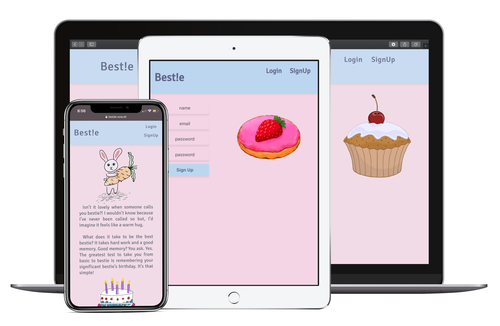
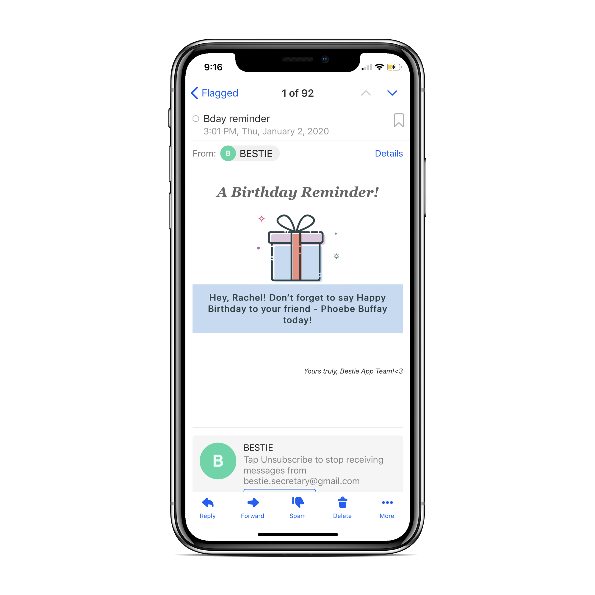

# Bestie-server!

This is a server for **the Bestie App**.

_Bestie_ is an app which sends you email reminders about your friends’ birthdays.

You can find the client repo [here](https://github.com/pashatay/bestie).

For the [live page](https://bestie.now.sh/), the server runs on heroku.

You can use the foolowing demo user credentials:

- email: user@gmail.com
- password: user

## To set up the server localy:

1. Clone this repository to your local machine `git clone https://github.com/pashatay/bestie-server NEW-PROJECTS-NAME`
2. `cd` into the cloned repository
3. Create your local project database and testing database. Update **config.js** accordingly.
4. Run _Migration_ files to seed your databases.
5. Enable the CRON task that runs _Email Reminders_ function every night. Go to **cron.js** in **src** directory and uncomment _line #25_.

## Scripts

Start the application `npm start`

Start nodemon for the application `npm run dev`

Run the tests `npm test`

Run migration `npm run migrate`

Run migration for testing database `npm run migrate:test`
